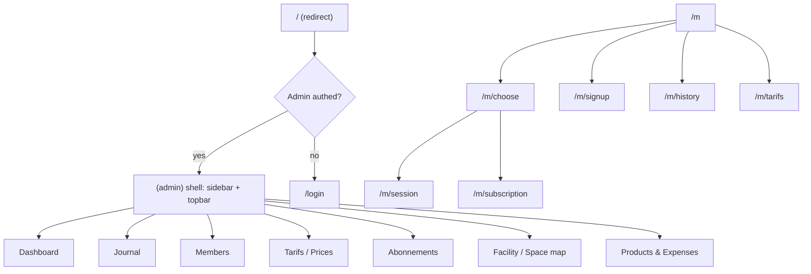

# Collabora Hub — New Frontend Design

Full architecture, design system and feature spec for a brand-new frontend, built with the same stack/conventions as `myschoolstore` (Next.js 15 + Tailwind + shadcn/ui). Replaces the current MUI `Front-end/` app. **This document is the source of truth** — implementation happens one phase at a time in later turns, checking off the roadmap at the bottom.

The backend (`backend/`, NestJS + Prisma + PostgreSQL + Socket.io) stays as-is. Every existing REST endpoint and socket event keeps working; only the seat-booking feature (Phase 5) needs a small backend change.

## 1. Goals

- Replace MUI with a modern Tailwind + shadcn/ui design, matching the quality bar of `myschoolstore`.
- Keep every feature that exists today (Journal, Abonnements, Tarifs, Members, Facility/Map, Products, Expenses, Visit Requests, mobile visitor app) and carry forward locked product decisions (paid ≠ checkout, visit-request approval flow, QR-based mobile onboarding).
- Drop the Seats.io dependency in favor of a simple, self-hosted seat picker.
- Ship incrementally: old `Front-end/` keeps running until the new app reaches parity and is cut over.

## 2. Stack (mirrors `myschoolstore`)

| Concern | Choice |
|---|---|
| Framework | Next.js 15, App Router, TypeScript, React 18 |
| Styling | Tailwind CSS + shadcn/ui (`components.json`, `baseColor: neutral`, CSS variables) |
| Icons | `lucide-react` |
| Data fetching | `@tanstack/react-query` (no Redux/RTK Query) |
| HTTP client | `lib/api/httpClient.ts` — bearer token + auto-refresh, same pattern as `myschoolstore` |
| Forms | `react-hook-form` + `zod` + `@hookform/resolvers` |
| Realtime | `socket.io-client` wrapped in a `RealtimeProvider` context |
| Toasts | `sonner` |
| Charts | `recharts` |
| Dates | `date-fns` |
| Fuzzy search | `fuse.js` (reused from current app) |
| i18n | None for v1 — single language app. Visitor copy stays French; admin stays French/English mixed as today. Can be added later without restructuring. |
| Theme | Light only, no dark-mode switcher for v1 |
| Auth storage | JWT access + refresh token in `localStorage`, same refresh-on-401 pattern as `myschoolstore/frontend/lib/api/httpClient.ts` |

Backend: **no changes** except Phase 5 (seat booking becomes local instead of proxying Seats.io).

## 3. Project layout

New folder `frontend/` at the repo root, sibling to `backend/` and the current `Front-end/` (kept untouched until Phase 7 cutover).

```
co-admin-system/
├── backend/                  # unchanged
├── Front-end/                 # old MUI app, kept until cutover
├── frontend/                  # NEW app
│   ├── app/
│   │   ├── (auth)/login/
│   │   ├── (admin)/
│   │   │   ├── layout.tsx     # sidebar + topbar shell, auth guard
│   │   │   ├── dashboard/
│   │   │   ├── journal/
│   │   │   ├── members/
│   │   │   ├── tarifs/
│   │   │   ├── abonnements/
│   │   │   ├── facility/
│   │   │   ├── products/
│   │   │   └── expenses/
│   │   ├── (visitor)/m/
│   │   │   ├── layout.tsx     # mobile shell, bottom nav
│   │   │   ├── page.tsx       # landing
│   │   │   ├── signup/
│   │   │   ├── choose/
│   │   │   ├── session/
│   │   │   ├── subscription/
│   │   │   ├── history/
│   │   │   └── tarifs/
│   │   ├── layout.tsx          # root providers
│   │   ├── page.tsx            # redirect: authed -> /dashboard, else -> /login
│   │   └── globals.css
│   ├── components/
│   │   ├── ui/                 # shadcn primitives
│   │   ├── admin/               # feature components (journal table, member search...)
│   │   └── visitor/              # mobile feature components
│   ├── lib/
│   │   ├── api/                 # httpClient.ts + one file per resource (journal.ts, members.ts...)
│   │   ├── auth/                 # AuthContext, protectedRoutes.ts
│   │   ├── realtime/              # socket client + RealtimeProvider
│   │   ├── query-client.tsx        # react-query provider + queryKeys
│   │   └── utils.ts
│   ├── hooks/
│   ├── components.json
│   ├── tailwind.config.ts
│   └── package.json
└── package.json                # root: dev / dev:backend / dev:frontend scripts
```

Root `package.json` gets `dev`, `dev:backend`, `dev:frontend` scripts (`concurrently`), same convenience pattern as `myschoolstore`'s root `package.json`.

## 4. Route architecture

`/m` stays the visitor entry point so already-printed/configured QR codes keep working.



## 5. Design system

- **Brand color**: Collabora Hub blue (`#1976d2` family) as the primary accent on a neutral (white/slate) shadcn base — keeps visual continuity with the current mobile UI.
- **Typography**: Geist or Inter, same type scale conventions as `myschoolstore`.
- **Core shadcn components** to install first (via `npx shadcn add`): `button`, `input`, `label`, `textarea`, `select`, `checkbox`, `switch`, `dialog`, `sheet`, `tabs`, `table`, `card`, `badge`, `avatar`, `dropdown-menu`, `command`, `calendar`, `popover`, `form`, `sonner`, `skeleton`, `separator`, `alert`, `progress`, `chart`.
- **Admin shell**: collapsible sidebar (nav: Dashboard, Journal, Members, Tarifs, Abonnements, Facility/Map, Products, Expenses) + topbar (search, notification bell for realtime visit requests, profile menu).
- **Visitor shell**: mobile-first single column, max width ~480px, bottom navigation (Session · Historique · Abonnement · Tarifs), French copy — same structure as today's `MobileVisitor.tsx`, restyled with shadcn.

## 6. Cross-cutting infrastructure

- **`lib/api/httpClient.ts`**: centralized fetch wrapper, attaches `Authorization: Bearer`, retries once on 401 after refreshing the token, throws on non-2xx. One thin resource file per backend module (`journal.ts`, `members.ts`, `abonnement.ts`, `price.ts`, `mobile.ts`, `facility.ts`, `product.ts`, `expense.ts`, `visitRequest.ts`).
- **`lib/query-client.tsx`**: `QueryClientProvider` + a central `queryKeys` object (mirrors `myschoolstore`'s pattern), so every hook shares consistent cache keys and invalidation.
- **`lib/realtime/`**: a `RealtimeProvider` wrapping `socket.io-client`, exposing a `useRealtime()` hook. Listens for `visit_request`, `visit_request_resolved`, `visitor_checkout`, `table_updates`, `payment_updated` and invalidates the matching react-query keys instead of manual refetch calls scattered across components.
- **`lib/auth/`**: `AuthContext` (admin JWT, login/logout, refresh) + `protectedRoutes.ts` (regex-based guard for `(admin)` routes, same pattern as `myschoolstore`). Visitor identity (`memberId`, `memberToken`, cached phone/name) keeps using `localStorage` via a small `visitorCache.ts`, ported from the current app.
- **Forms**: every create/edit form uses `react-hook-form` + `zod` schema + shadcn `Form` primitives — no more manual `watch()` wiring bugs like the MUI version had.

## 7. Feature modules — Admin

### Auth
Login page (email/password → JWT), refresh-on-401, guarded `(admin)` layout redirecting to `/login` when unauthenticated.

### Dashboard
Who's-here count, today's revenue, occupancy, upcoming subscription expirations, quick check-in shortcut, revenue/occupancy charts (recharts).

### Journal (check-in / check-out)

**Purpose**: the desk's main screen — who's here right now, check people in/out, track payment, all day, every day.

- **Default view**: today's journal, with a date picker (defaults to today, `date-fns` day navigation with prev/next arrows) to browse any past day. Switching the date is a query param so the page is linkable/bookmarkable.
- **KPI strip** at the top of the page: "Présents" (open sessions count), "Revenu du jour" (sum of `payedAmount` where `isPayed`), "Impayés" (count where `!isPayed`), "Places libres" (capacity from Facility minus present count). Cards use shadcn `Card` + `Badge`.
- **Toolbar**: search input (fuzzy, name/phone/visitor number via Fuse.js), status filter (`Tous` / `Présent` / `Parti`), payment filter (`Tous` / `Payé` / `Non payé`), primary **"+ Check-in"** button opening the quick check-in panel.
- **Quick check-in panel** (`Sheet` or inline card, reused across sessions): member search combobox with recent/frequent members shown first, falls back to an inline "Nouveau membre" mini-form (first name + phone) when no match — creates the member and immediately proceeds to pack selection without a page change. Pack selection shows `Journée` category price cards (name, duration, price) as selectable tiles; selecting one calls the check-in endpoint and closes the panel with a toast confirmation.
- **Table** (`@tanstack/react-table` + shadcn `Table`), one row per journal entry for the selected day:
  - Columns: Visitor `#`, Name (+ phone as secondary text), Pack/Tarif name, Heure d'arrivée, Durée (live-ticking for open rows, static for closed rows), Montant, **Payé** (a `Switch` inline in the row — flips independently of checkout via `PATCH /mobile/session/:id/payment` or the admin journal payment endpoint), Statut (`En cours` / `Terminé` badge from `leaveTime`), Actions.
  - Row actions: one-click **Checkout** icon button (only shown while `leaveTime` is null), **Edit** (opens the edit `Sheet`), **Delete** (confirmation `AlertDialog`).
- **Edit sheet**: `react-hook-form` + `zod`, fields — member (read-only once created), pack/price picker (same tiles as quick check-in), `registredTime` (date-time picker), `leaveTime` (nullable date-time picker with a "Marquer comme présent" clear action — never required), `isPayed` switch, `payedAmount` (editable number, so the desk can adjust for overstay), `isReservation` switch. **Payé and checkout are two independent fields in the schema** — carries forward the locked product decision: a visitor can be marked paid while still checked in, and checking out never forces `isPayed` to `true`.
- **Overstay handling**: when a row's live duration exceeds its pack's `durationHours`, show an amber "Dépassement" badge next to Durée; the pack price is kept as-is until the desk manually adjusts `payedAmount` at checkout/edit.
- **Realtime**: subscribes to `table_updates`, `visitor_checkout`, `payment_updated`, `visit_request_resolved` — new check-ins/checkouts/payment flips update the table and KPI strip live, no manual refresh, with a small toast for new arrivals from the mobile flow.
- **Empty/loading/error**: skeleton rows while loading, an illustrated empty state ("Aucune visite aujourd'hui" + the Check-in button) when the day has no entries, inline `Alert` on request failure with a retry button.

### Visit requests
Realtime popup + notification bell (badge count from `visit_request` / `visit_request_resolved` socket events), Approve/Reject actions, list of pending/resolved requests.

### Members

**Purpose**: single source of truth for every person who has ever visited — contact info, visit history, subscription status, payment history.

- **Directory table**: columns Visitor `#`, Name, Phone, Plan badge (`Abonné actif` green / `Visiteur` neutral / `Abonnement expire bientôt` orange when ≤3 days left), Credits, Dernière visite (relative date, e.g. "il y a 2 jours"), Actions. Sortable columns, paginated, fuzzy search bar (name/phone/visitor `#`) using the same `Command` + Fuse.js pattern as Journal.
- **"+ Nouveau membre"** button opens a `Sheet` form: first name, last name (optional), phone (required, unique), email (optional), password (optional — only needed if the member will use the mobile subscription login). Same form component is reused by Journal's inline "new member" flow.
- **Member detail** (route `members/[id]`, or a wide `Sheet` if it's faster to ship): tabbed view —
  - **Aperçu**: editable contact fields, visitor number (read-only, admin-assigned), active/inactive toggle.
  - **Historique des visites**: that member's Journal rows (reuses the Journal table component in read-only/filtered mode), paid/unpaid badges.
  - **Abonnements**: that member's Abonnement rows, validity dates, renew shortcut straight into the Abonnements create form pre-filled with this member.
  - **Paiements**: totals — amount paid, amount still owed, across both Journal and Abonnement records.
- **Quick actions** from the row menu (shadcn `DropdownMenu`): copy phone number, open detail, reset mobile password, deactivate.

### Tarifs (Prices)

**Purpose**: manage every priced product the space sells — day packs, hourly rooms, and subscription periods — in one structured catalog instead of free-text price fields.

- **Category tabs**: `Journée` (PACK), `Salle` (HOURLY/PACK), `Open space` (HOURLY/PACK), `Abonnement` (PERIOD) — matches `PriceCategory`. Each tab shows a responsive grid of price cards (name, price, duration/period badge, billing-unit icon) with edit/delete actions on hover, plus a **"+ Ajouter un tarif"** button.
- **"Seed Collabora Hub tarifs"** button (only enabled while any catalog rows from `featuresUrgentbeforeupdate.md`'s price list are missing) — calls the existing seed endpoint and toasts how many rows were created.
- **Create/edit form** (`Dialog`, `react-hook-form` + `zod`): name, category (`Select`), billing unit (`Select`: Pack / Hourly / Period) — the schema uses a `zod` discriminated union so only the relevant field is required per billing unit (`durationHours` for Pack/Hourly, `periodDays` for Period), price. `type` (`journal` | `abonnement`) is derived automatically from the chosen category so the desk never has to think about it.
- **Delete protection**: before deleting, check (client-side count query) whether any Journal/Abonnement/VisitRequest still references this price; if so, show a warning dialog instead of a silent failure.

### Abonnements
List/create/edit subscriptions, payment status toggle, validity dates (`registredDate` / `leaveDate` from `periodDays`), renew flow.

### Facility & space map (replaces Seats.io)
- Facility profile form: name, contact, social links, printable QR pointing to `/m`.
- **Custom seat picker** instead of Seats.io: admin defines named spaces + seat labels (e.g. `Desk-1`…`Desk-12`) in Facility settings. The Map page renders seats as a grid of status chips (free / occupied / reserved) grouped by space; clicking a free seat assigns the currently checked-in member's journal to it, clicking an occupied seat shows who's there and lets the admin release it.
- Backed by the existing `SeatBooking` Prisma model — direct Prisma CRUD, no external Seats.io HTTP calls. This is the one backend change in the whole plan, scoped entirely to Phase 5.

### Products & expenses
Product/stock CRUD, daily product usage logs, expense CRUD, daily expense logs — same shape as today, restyled.

### Reports
Revenue/occupancy trend charts (recharts) with a date-range filter, built once the above modules are wired.

## 8. Feature modules — Visitor mobile (`/m`) — detailed design spec

General rules for the whole mobile web app:

- **Viewport**: mobile-first, content column capped at `max-w-[480px]` and centered, so it also looks correct on a desktop browser (some visitors will open the QR link on a laptop).
- **Shell**: sticky header (Collabora Hub wordmark + current step, no back-button chrome needed since navigation is linear), content area with `px-4 py-6` padding, sticky bottom navigation bar (`Session · Historique · Abonnement · Tarifs`) built with shadcn `Tabs`-styled buttons + `lucide-react` icons, active tab highlighted in the brand blue.
- **Language**: 100% French copy, plain everyday wording (this is a walk-up kiosk flow, not a SaaS onboarding).
- **Loading/offline**: every screen has a skeleton state for its main content block and a retry `Alert` on network failure (coworking wifi can be flaky).
- **Identity persistence**: `memberId` + optional `memberToken` + cached phone/name kept in `localStorage` (`visitorCache.ts`, ported as-is) so a returning visitor skips signup entirely.

### `/m` — Landing

- **Layout**: greeting header, one status `Alert` (conditional), then exactly two primary actions.
- **States**:
  - **No cached identity**: two full-width buttons — **"Choisir un forfait"** (primary, filled) and **"Choisir un abonnement"** (secondary, outlined) — each routes to `/m/signup?mode=day|subscription`.
  - **Cached identity, no open session/request**: same two buttons, routing straight to `/m/choose?mode=...` (signup skipped).
  - **Open session**: replaces the two buttons with a single **"Voir ma session"** button to `/m/session`.
  - **Pending visit request**: an info `Alert` "Demande en attente de confirmation à l'accueil" showing the requested pack name, with two inline buttons — **"Annuler"** (secondary — cancels the request via the cancel endpoint, returns to the two main choices) and **"Voir ma demande"** (primary — goes to `/m/choose` to see the waiting screen). The two main action buttons are disabled while a request is pending.
- **Footer link**: "Voir les tarifs" → `/m/tarifs`, always visible regardless of state.

### `/m/signup` — Identity

- Single-column form, shown only when there is no cached identity.
- **Fields**: Prénom (optional, only shown in `mode=subscription` since the day-pass flow doesn't need a name), Téléphone (required, numeric keyboard `inputMode="tel"`), Mot de passe (only rendered and required when `mode=subscription`).
- **Helper text** changes by mode: day mode says phone is enough; subscription mode explains the password is needed to check subscription status later.
- **Submit**: registers/logs in the member, caches identity, routes to `/m/choose?mode=...`.
- **Validation**: `zod` — phone required non-empty string, password min length 4 when required.

### `/m/choose` — Pack / plan picker

- **Header**: "Forfait" or "Abonnement" depending on `mode`, subtitle "L'accueil confirmera pour démarrer."
- **List**: vertical stack of selectable cards, one per `Price` in the relevant category (`JOURNEE` for day mode, `ABONNEMENT` for subscription mode) — each card shows name, duration/period, and price, tap targets are the full card (min height 56px for touch).
- **Blocked states** (each replaces the list with a full-width message + single action):
  - Already has an open day session → info alert + **"Voir ma session"** button.
  - Pending request exists → spinner + "En attente de confirmation" copy + **"Annuler ma demande"** button (same cancel endpoint as the landing page) so the visitor is never stuck waiting with no way out.
  - Request was rejected → error alert "Demande refusée. Choisissez un autre forfait." + **"Réessayer"** button that clears the rejected state and re-shows the picker.
- **Realtime**: listens for `visit_request_resolved` over the socket; on approval it auto-navigates to `/m/session` (day) or `/m/subscription` (subscription) without the visitor needing to refresh.

### `/m/session` — Active day session

- **Header**: pack name as an overline + title.
- **Payment badge**: `Badge` showing "Payé" (green) or "Non payé" (amber) — **purely informational and independent from checkout**; there is no action here that changes payment status on the visitor side (that stays an admin action), it just reflects `isPayed`.
- **Timer card**: the big centered element — countdown `HH:MM:SS` for day packs, ticking down from `expectedLeaveTime`; switches to a red "+HH:MM:SS overtime" count-up display past zero, with a small note "Le prix du forfait reste affiché ; l'accueil peut ajuster."
- **Amount due**: large price display below the timer.
- **Subscription coverage note**: if `hasActiveSubscription` is true, an additional success `Alert` explains the visit is covered.
- **Checkout button**: full-width primary button, disabled while already checked out (`leaveTime` set) or mid-request; calls the checkout endpoint **without** touching `isPayed`.
- **Footer link**: "Comment sont calculés les tarifs ?" → `/m/tarifs`.
- **No active session**: friendly empty state ("Aucune session") + **"Choisir un forfait"** button back into the flow.

### `/m/subscription` — Active plan

- Shows plan name, start/end dates, and a "days remaining" counter (large number + "jours restants" caption), with a low-remaining warning style (amber) when ≤3 days left.
- If no active subscription: empty state + **"Choisir un abonnement"** button.

### `/m/history` — Past visits

- Simple reverse-chronological list (`Card` per entry): date, duration, pack/plan name, paid/unpaid badge, open/closed indicator for the current day's entry.
- Empty state: "Aucune visite pour le moment."

### `/m/tarifs` — Pricing explainer

- Public, no identity required. Same poster-style grouped sections as today (Journée / Salle / Open space / Abonnement), each price rendered as a read-only card identical in style to the `/m/choose` cards for visual consistency, plus a couple of plain-language rules (e.g. how overtime is handled) reused from the current copy.

All visitor-facing copy stays in French. Admin confirmation flow (visit request → pending → Confirm/Reject → session/subscription starts) is unchanged.

## 9. Daily operations control (what the desk needs to run the space day-to-day)

Beyond individual CRUD screens, the admin app needs a layer of features specifically about *running the business day by day* — noticing problems early, closing the day out correctly, and keeping an accountability trail. These live mostly on the **Dashboard** and inside the notification bell, reusing data already in the API (no backend change) except where noted.

- **Live occupancy monitor** — current "present" count (open Journal rows) vs. `Facility.nbrPlaces` capacity, shown as a progress bar on the Dashboard; turns amber at 80% and red at 100% so the desk knows when the space is full. *(No backend change — computed client-side from existing Journal + Facility queries.)*
- **Alerts center** — extends the existing notification bell beyond visit requests into a unified list of everything that needs attention today:
  - Sessions overstaying their pack duration (open Journal past `registredTime + durationHours`).
  - Open sessions still unpaid after N hours.
  - Subscriptions expiring within 3 days (or already expired but member still marked active).
  - Products below a low-stock threshold.
  Each alert links straight to the relevant row (Journal, Members, or Products). *(No backend change — computed client-side by polling/subscribing to existing data.)*
- **End-of-day summary** — a "Clôture du jour" view (Dashboard section or its own route) showing: revenue breakdown by category (Journée / Salle / Open space / Abonnement / Produits), paid vs. still-owed totals, number of new members created today, subscriptions started/renewed/expired today, peak occupancy. Exportable/printable via the browser print dialog. *(No backend change — aggregation of existing endpoints for the selected day.)*
- **Cash reconciliation** — at closing, the desk enters the counted cash amount; the app shows the expected total (sum of today's paid Journal + Abonnement + Product amounts) side by side with the delta highlighted. This needs a tiny persistence layer to keep a historical record of each day's reconciliation.
- **Shift handover notes** — a short free-text note the outgoing staff leaves for the next shift ("Client X owes 5 DT", "Room booked for 3pm"), shown at the top of the Dashboard until dismissed by the next login. Also needs persistence.
- **Staff activity log** — a filterable audit trail (by day, by staff member) of check-ins, checkouts, payment toggles, and price/member edits, built from the existing `createdbyUserID` field on `Journal` plus lightweight `updatedAt` diffing. *(No backend change for the Journal-based portion.)*

Cash reconciliation and shift handover notes are the only two operations-control features that need new backend storage; they're added as two small Prisma models (`DailyClosing`, `ShiftNote`) and two thin controllers, scoped into Phase 6 alongside Products/Expenses/Reports (see roadmap below) rather than as a separate phase.

## 10. Data model

Two new small Prisma models are added (`DailyClosing`, `ShiftNote`, see §9), scoped to Phase 6. Seat booking becomes local CRUD instead of a Seats.io proxy in Phase 5 — the `SeatBooking` table itself is reused as-is. Every other model (`Member`, `Price`, `Journal`, `Abonnement`, `VisitRequest`, `Facility`, `Product`, `Expense`) and REST endpoint stays the same; the new frontend is a like-for-like consumer via the react-query resource files in `lib/api/`.

## 12. Floor-plan map + Simple finance + ERP bridge (2026-08)

- **Structured layout**: `Space` / `Table` / `Seat` (with `isOverflow`) + floor-plan canvas UI under Facility / Map. Legacy `Facility.places` JSON still migrates on first layout load.
- **OpsEvent** append-only for analytics/signal rules (`GET /ops-events`).
- **Simple finance**: `/finance` — caisse open/close/clôture, day P&L, daily products/expenses (`CaisseSession` / `CaisseMovement`).
- **ERP bridge**: on clôture, optional POST to supply-chainpro `POST /coworking/:orgId/day-close` when `ERP_SYNC_ENABLED=true`. See `docs/coworking-bridge.md`.

## 11. Phased roadmap

Each phase is implemented in its own future turn: propose the concrete file/component list for that phase, then build it, then check it off here.

- [x] **Phase 0 — Scaffold & design system**: create `frontend/`, Tailwind/shadcn init, core UI kit installed, `httpClient`, react-query provider + `queryKeys`, `RealtimeProvider`, auth context, route-group shells, root redirect.
- [x] **Phase 1 — Admin auth + shell + dashboard**: login, protected `(admin)` guard, sidebar/topbar, dashboard KPIs/charts, live occupancy monitor, alerts center.
- [x] **Phase 2 — Journal core**: member search, quick check-in, journal table + form, visit-request popup/bell, overstay handling.
- [x] **Phase 3 — Members, Tarifs, Abonnements**: the three CRUD-heavy admin modules, including member detail tabs.
- [x] **Phase 4 — Visitor mobile app**: all `/m` routes end to end, wired to the existing mobile API.
- [x] **Phase 5 — Facility & space booking**: facility profile + custom seat picker, drop Seats.io on both ends (small backend change here).
- [x] **Phase 6 — Products, expenses, reports & daily operations control**: remaining back-office CRUD, end-of-day summary, staff activity log, plus the two new backend models (`DailyClosing`, `ShiftNote`) for cash reconciliation and shift handover notes.
- [x] **Phase 7 — Cutover & cleanup**: point QR/domain to `frontend/`, retire old `Front-end/`, remove Seats.io env/keys, finalize root scripts.

**Cutover notes (Phase 7):** New app runs on port **3001** (`frontend/`). Legacy MUI app remains on **3000** (`Front-end/`) until you switch DNS/QR to the new URL. Seats.io calls removed from `backend/src/proxy/proxy.service.ts` — bookings are local DB only. Root scripts: `dev:frontend` → new app, `dev:frontend-legacy` → old app.
