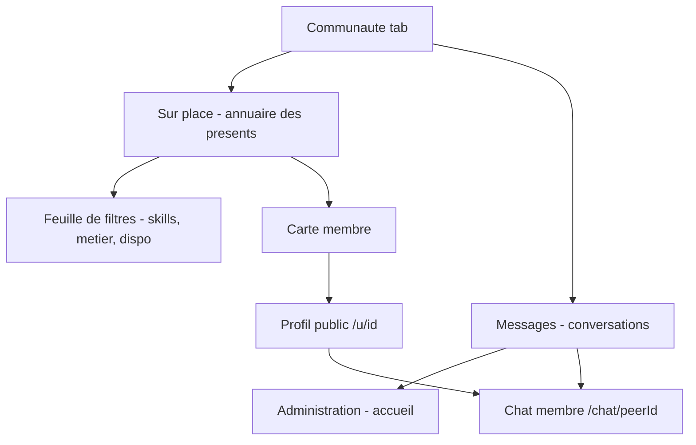
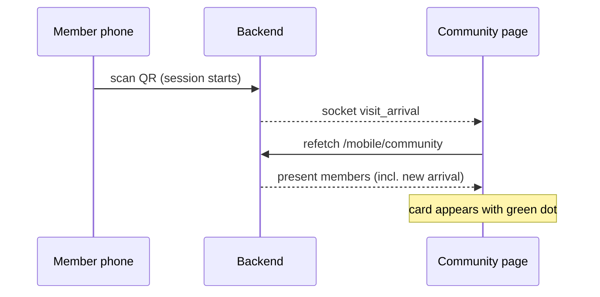

# Communauté — Workspace Network Redesign

Design spec for the Collabora Hub community section: a **presence-first workspace network**.
The community shows **only members physically present** at the space ("sur place" = connected),
with social-network-grade profiles and skills filtering.

> Principle: this is not LinkedIn. The value is **who is in the room right now** —
> the app answers "who can I talk to, about what, and where are they sitting?".

---

## 1. Concept

| Aspect | Decision |
|---|---|
| Who appears in Annuaire | **Only present members** (open session today, not checked out). Absent members are not listed at all. |
| "Connected" definition | Physically present = green presence dot. No other online state exists. |
| Messages | Existing conversations stay visible (history). Peers show the green dot only when present. New conversations start from the Annuaire (present people) or from a profile opened via an old thread. |
| Public profile `/u/[id]` | Still reachable from a conversation even if the member left (needed for chat context), but shows no presence badge when absent. |
| Privacy | `showInDirectory=false` keeps a member out of the Annuaire even when present (unchanged). |

### Why strict presence
- Zero stale content: no directory of ghost profiles.
- Encourages real-world interaction: "il est là maintenant" → go say hi or send a message.
- Makes the empty state meaningful ("Personne sur place — revenez plus tard").

---

## 2. Information architecture



Tab order changes: **"Sur place" becomes the default tab** (currently "Messages" is).
The point of the section is discovery; messages are one tap away and already
reachable from the header bell/inbox.

---

## 3. Mock design (wireframes)

### 3.1 Sur place (default tab)

```
┌─────────────────────────────────────────┐
│ ‹  Communauté                    ⟳  🔔  │  ← existing sticky header
├─────────────────────────────────────────┤
│ ┌─────────────────────────────────────┐ │
│ │ ●7  SUR PLACE MAINTENANT            │ │  ← hero strip (white card)
│ │ (🧑)(🧑)(🧑)(🧑)(🧑) +2             │ │    avatar stack, live count
│ └─────────────────────────────────────┘ │
│                                         │
│ ┌──────────────┐  ┌──────────────────┐  │
│ │ Sur place ●7 │  │  Messages  (2)   │  │  ← segmented control
│ └──────────────┘  └──────────────────┘  │    (indigo fill = active)
│                                         │
│ 🔍 Rechercher nom, métier, skill…       │  ← search input
│                                         │
│ [Design ✓] [React] [SEO] [Vidéo] [⚙ +] │  ← skill chips row, horizontal
│                                         │    scroll, multi-select,
│                                         │    "⚙ Filtres" opens sheet
│ ┌─────────────────────────────────────┐ │
│ │ (🧑●) Sarra Ben Ali        [💬]     │ │  ← member card
│ │      UI Designer · Salle A, P3      │ │    green dot on avatar
│ │      ☕ Dispo pour échanger          │ │    availability pill
│ │      [Figma] [Branding] +2          │ │    skills (max 3 + n)
│ ├─────────────────────────────────────┤ │
│ │ (🧑●) Mehdi Trabelsi       [💬]     │ │
│ │      Dév fullstack · Open space     │ │
│ │      🎧 Focus — ne pas déranger     │ │
│ │      [React] [Node] [AWS]           │ │
│ └─────────────────────────────────────┘ │
│                                         │
│         (bottom nav: Accueil…)          │
└─────────────────────────────────────────┘
```

### 3.2 Member card anatomy

```
┌───────────────────────────────────────────────┐
│  ╭────╮                                       │
│  │ 🧑 │●   Sarra Ben Ali              ┌────┐  │
│  ╰────╯    UI Designer · Salle A, P3  │ 💬 │  │
│            ☕ Dispo pour échanger      └────┘  │
│            [Figma] [Branding] [+2]            │
│            🤝 Recherche : dev mobile          │
└───────────────────────────────────────────────┘
```

- Avatar 48px, **emerald dot with subtle pulse** bottom-right (present = always on here).
- Line 1: name (bold) + round message button (indigo, `h-9 w-9`).
- Line 2: métier · **seat/space location** (from seat assignment — workspace superpower).
- Line 3: availability pill — one of:
  - `☕ Dispo pour échanger` (emerald tint)
  - `🎧 Focus` (amber tint, message button still enabled but hint "répond plus tard")
  - none set → pill hidden.
- Line 4: up to 3 skill chips + `+n`; matched filter chips highlighted indigo.
- Line 5 (optional): `🤝 Recherche : …` when `lookingFor` is set — strongest
  collaboration signal, so it earns a dedicated line.
- Whole card taps to `/u/[id]`; the 💬 button deep-links to `/chat/[id]`.

### 3.3 Filter sheet (bottom sheet, opened from "⚙ Filtres")

```
┌─────────────────────────────────────────┐
│              ── (drag bar) ──           │
│  Filtres                       Effacer  │
│                                         │
│  DISPONIBILITÉ                          │
│  [Tous] [☕ Dispo] [🎧 Focus]           │
│                                         │
│  MÉTIER                                 │
│  [Designer (3)] [Dév (2)] [Marketing]   │
│                                         │
│  COMPÉTENCES          🔍 filtrer…       │
│  [React (4)] [Figma (2)] [SEO (2)]      │
│  [Node (1)] [Vidéo (1)] …               │
│                                         │
│  🤝 [ ] Ouvert à la collaboration       │
│                                         │
│  ┌───────────────────────────────────┐  │
│  │        Voir 5 membres             │  │  ← live result count
│  └───────────────────────────────────┘  │
└─────────────────────────────────────────┘
```

- **Multi-select** everywhere (current UI is single-select), chips show counts.
- Selected filters echo back on the main screen as active chips; a "×" chip clears all.
- Skill list gets its own mini search when > 12 skills.

### 3.4 Empty states

```
Nobody present:                     Filters match nobody:
┌─────────────────────────┐         ┌─────────────────────────┐
│      🌙 (soft circle)   │         │   Aucun membre ne       │
│  Personne sur place     │         │   correspond aux        │
│  pour le moment         │         │   filtres.              │
│                         │         │   [Effacer les filtres] │
│  Les membres présents   │         └─────────────────────────┘
│  apparaissent ici dès   │
│  qu'ils scannent.       │
│  [Voir mes messages]    │
└─────────────────────────┘
```

### 3.5 Public profile `/u/[id]` (refresh)

Keep the current structure (banner, avatar, bio, skills, services, événements) with:
- Presence: emerald `● Sur place · Salle A, P3` badge when present; nothing when absent.
- Availability pill next to the presence badge.
- New sections: `🤝 Recherche` (lookingFor tags) and `💼 Propose` (rename of "Services").
- Skill chips are tappable → back to Annuaire with that skill filter applied.

---

## 4. Data model changes (Prisma `Member`)

```prisma
enum MemberAvailability {
  OPEN_TO_CHAT   // ☕ Dispo pour échanger
  FOCUS          // 🎧 Focus — ne pas déranger
}

model Member {
  // existing: skills[], services[], linkedinUrl, openToCollaboration, showInDirectory…
  availability MemberAvailability?   // null = not set
  lookingFor   String[] @default([]) // "🤝 Recherche : …" tags
}
```

- `services` is kept and displayed as **"Propose"** (offering) — no rename in DB.
- One migration; no backfill needed (defaults are fine).

## 5. API changes

| Endpoint | Change |
|---|---|
| `GET /mobile/community` | Filter **server-side to present members only** (reuse the open-journal query already in `listCommunity`); add `seat` (space name + seat label via `resolveSeatForMember`), `availability`, `lookingFor` to the payload. Absent members are never sent. |
| `GET /mobile/community/member/:id` | Add `availability`, `lookingFor`, and seat info when present (member fields flow through `sanitizeMember`). |
| `PATCH /mobile/profile` | Accept `availability` and `lookingFor[]` in `UpdateMobileProfileDto`. |

`sanitizeMember` in [backend/src/modules/mobile/mobile.service.ts](backend/src/modules/mobile/mobile.service.ts)
gains the two new fields.

## 6. Realtime presence

The gateway already broadcasts `visit_arrival`, `visitor_checkout` and `table_updates`
([backend/src/modules/webSocket/events.gateway.ts](backend/src/modules/webSocket/events.gateway.ts)).
The community page subscribes and invalidates `["mobile-community"]` so the list
updates live as people scan in/out — no backend change needed. Keep a 60s
`refetchInterval` as fallback when the socket is down.



## 7. Profile editing

Profile edit dialog (Profil page) gains:
- **Disponibilité** segmented: `Non défini / ☕ Dispo / 🎧 Focus` — one tap, resets nothing.
- **Recherche** tag input (same `TagInput` component as skills).
- "Services" relabelled **"Propose"** in the UI.

Availability is deliberately manual (no auto-reset on checkout) for v1 — simple and predictable.

## 8. Edge cases

- **Self in list**: keep excluding the viewer (current behavior); their presence shows in the hero count.
- **Light accounts** (no PIN): community stays account+app gated (unchanged `MobileShell` rules).
- **Member leaves while browsing**: checkout event removes the card live; if their profile is open it simply loses the presence badge.
- **No seat assigned**: location line falls back to métier only.
- **Old conversations with absent members**: kept in Messages; profile reachable; no dot.

## 9. Design system compliance (mobile-design.mdc)

White `rounded-3xl` cards on `#f3f6fb`, single indigo accent, emerald reserved for
presence/availability-positive, amber for Focus. One filled button per screen
(the sheet's "Voir n membres"). Section labels `text-[10px] uppercase slate-400`.

## 10. Implementation phases

1. **Backend**: migration (availability, lookingFor) → DTO + `sanitizeMember` → presence-only + seat info in `listCommunity`.
2. **Frontend annuaire**: new tab order, hero strip, member cards, empty states, live socket refresh.
3. **Filters**: multi-select chips + bottom sheet with counts and result preview.
4. **Profile**: public profile refresh + edit dialog fields.
